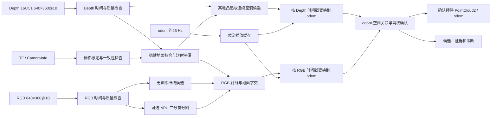

# RGB-D 电线与低矮障碍物最终开发方案

- 版本：2.0
- 日期：2026-08-25
- 平台：DCW2 + RK3588，ROS 2 Humble
- 当前运行上限：0.3 m/s
- 文档状态：家庭可行性阶段的最终开发基线

## 1. 最终结论

原方案的核心方向合理且有优势：用深度几何发现未知凸起，用 RGB 语义补齐细电线，再做时序确认。它优于单纯目标检测、固定颜色阈值或单一高度阈值，因为插线板不需要被分类，细电线也不会因深度噪声而被完全放弃。

最终方案保留这一核心，但做五项关键修正：

1. 不再强制 RGB–Depth 像素级同步；两路按各自时间戳生成观测，在 `odom` 中异步融合。
2. 不信任写死的安装高度和俯角；逐帧拟合观测地面，TF 只提供初值与一致性检查。
3. 感知只发布障碍观测和健康状态，不直接控制减速、停车、重规划或写死导航策略。
4. 第一阶段不训练模型，先交付深度几何和无训练 RGB 细线候选；只有规则法暴露稳定缺口后，才训练小型二分类分割模型并部署到 NPU。
5. 所有尺寸、内参、时间戳和帧率从消息读取。当前实测基线为 640×360@10 fps，而不是配置文件宣称的 640×400。

这套方案能够以较低 CPU 成本检测插线板等通用凸起，并为电线提供可解释的多证据检测。它可以作为研发与家庭测试基线，但没有工厂数据前不能宣称达到工厂安全指标。

## 2. 已验证的系统基线

| 项目 | 最终基线 |
|---|---|
| 相机 | Orbbec DCW2，硬件 D2C 对齐 |
| 实际 RGB/Depth | 640×360，约 10 fps |
| 深度编码 | `16UC1`，毫米值 |
| 对齐坐标系 | `camera_1_color_optical_frame` |
| 相机位置 | `base_footprint` 前方约 0.33 m |
| 实测光心高度 | 约 0.22–0.23 m |
| 实测俯角 | 约 2.5°–3°向下 |
| 里程计 | `/odom`，bag 实测约 23–25 Hz |
| 机器人 footprint | 前后 ±0.375 m，左右 ±0.33 m |
| 运行速度上限 | 0.3 m/s |
| 减速度 | 1 m/s² |
| 确认规则 | 两次空间一致的独立观测 |
| 推理硬件 | RK3588 NPU 可用，CPU 负责几何与融合 |

详细测量见 [DCW2 家庭 RGB-D 样本实测报告](./experiments/0001-dcw2-home-rgbd-bag-findings.md)。

## 3. 安全距离边界

当前相机能看到的最近地面约位于 `base_footprint` 前方 0.74 m，机器人前缘为 0.375 m，因此车体前方未观测间隙约 0.365 m。

采用下列保守预算：

| 分量 | 数值 | 0.3 m/s 下距离 |
|---|---:|---:|
| RGB 到达延迟 P95 | 0.218 s | 0.065 m |
| 两帧确认最坏等待 | 0.200 s | 0.060 m |
| 外部响应预留 | 0.100 s | 0.030 m |
| 制动距离 | — | 0.045 m |
| 合计 | — | 约 0.200 m |

相对 0.365 m 未观测间隙，理论余量约 0.165 m。最终发布版仍须用真实统一障碍响应链完成整机停车试验。

当前检测配置必须绑定 `max_validated_speed=0.3 m/s`。0.8 m/s 时同一预算需要约 0.734 m，不能沿用当前配置。感知节点不负责发停车指令，但必须发布消息年龄、处理延迟、配置对应速度和健康状态，供下游拒绝超龄结果。

确认后的障碍不能因为进入相机盲区而立即消失。`odom` 中的确认结果建议至少保留 2 s，实际清除由观测可见性和下游地图策略共同决定。

## 4. 最终软件架构



模块之间传递带来源时间戳的观测，不传递“已经同步”的图像对。内部禁止直接累加未按时间变换的点云。

## 5. 算法设计

### 5.1 输入、时间与队列

- RGB、Depth、CameraInfo、TF 和 odom 分开订阅。
- 图像订阅采用深度 1 的 drop-oldest 队列，禁止积压旧帧。
- 保存消息时间戳、接收时间和处理完成时间，分别统计传输延迟与计算延迟。
- 对 `/odom` 做时间有序缓存并进行平移和偏航插值；不能假设其为 100 Hz。
- 消息尺寸、步长、编码和 CameraInfo 不一致时拒绝该帧并上报诊断。
- 当前 DCW2 驱动配置的 `use_hardware_time` 为 false；在证明时间戳代表曝光时刻之前，文档中统一称为 `sensor_stamp`，不宣称为真实硬件曝光时间。

### 5.2 观测地面模型

每个可用深度帧执行：

1. 在三维前向 ROI 内抽样有效深度，不把无效值预先填成地面。
2. 在 320×180 或等效稀疏采样上进行带方向约束的 RANSAC。
3. 使用内点做稳健精拟合，输出平面、MAD、覆盖率和内点比例。
4. 以最近若干有效帧做短时平滑，但保留当前帧突变检测。
5. 将拟合高度/角度与 TF 标称值比较，持续偏离时发布安装或标定告警。

初始建议：

```text
RANSAC 次数                 100–200
初始内点阈值               8 mm
最低内点比例               70%
最低横向/纵向覆盖           由回放数据标定
h_low                       max(3σ_ground, 6 mm)
h_high                      max(5σ_ground, 15 mm)
低矮障碍最大高度            150 mm
```

质量不足时状态为 `DEGRADED/INVALID`，不得输出“地面安全”，也不得用旧平面无限期清除障碍。

### 5.3 通用几何障碍物

深度通路负责插线板、插头、薄盒、翘起地垫和未知凸起，不做类别识别：

- `height >= h_high` 且具有足够空间支持：强几何候选；
- `h_low <= height < h_high`：只有细长连通、跨帧持续或得到 RGB 支持时保留；
- 单个最大高度点不触发障碍，采用局部 P90/P95、top-k 或支持点计数；
- 在三维/鸟瞰坐标中聚类，避免图像透视导致距离阈值不一致；
- 输出真实曲线或占用点，不用大矩形框代替。

本次 bag 中插线板相对于相邻地面有明显可分性，首版应优先完成该通路。

### 5.4 无效深度

黑色、反光、遮挡边界和电线都可能产生 `depth == 0`。处理原则：

- 零散或大面积无效深度不能单独确认障碍；
- 只有位于高质量地面预测区域、形状连续，并与 RGB 细线或几何边界吻合时，才作为加分证据；
- RGB 电线像素没有深度时，通过射线与地面求交获得保守位置；
- 调试输出必须区分 `INVALID_DEPTH` 与 `VALID_HEIGHT`，避免把二者混成同一种绿色障碍。

### 5.5 RGB 电线通路：先无训练，后小模型

第一阶段无需训练集，采用低成本候选生成：

1. 仅在地面投影 ROI 内工作，排除悬挂电线、桌腿和背景结构。
2. 计算 Lab/灰度局部对比度，而不是只认绝对颜色。
3. 使用多尺度亮/暗脊线或成对边缘响应提取约 1–8 像素宽的细长结构。
4. 依据长度、宽度一致性、平滑曲率、分叉/交叉和跨帧连续性评分。
5. 将候选骨架投影到地面；深度高度或连续空洞只作为证据加权。

`wire_perception_pink.yaml` 只保留为粉色演示配置。当前 `min_component_area_px: 5000` 与 640×360 不匹配，正式算法不得依赖大面积阈值，应改用长度、宽度、物理跨度和连续性。

如果无训练规则在白线反光、地缝、阴影等困难负样本上无法同时满足召回和误报要求，再启用 NPU：

- 模型任务仅为 `CABLE / BACKGROUND` 二分类分割；
- 输入保持 640×360 内容，可 padding 到 640×384，禁止拉伸；
- 输出步长不大于 4，避免抹掉 2–5 像素电线；
- 使用中心线/边界友好的损失和量化前后回归；
- 在 RK3588 NPU 异步运行，CPU 不承担神经网络推理；
- NPU 失败时几何通路继续运行并发布降级状态。

### 5.6 odom 异步融合与确认

每项观测包含：来源时间戳、空间点/曲线、证据类型、置信度、地面质量和处理延迟。

建议初始规则：

```text
空间关联半径              50–80 mm
确认要求                  2 次独立观测
最大确认时间窗            0.35 s
候选保留                  0.4–0.6 s
确认障碍最短保留          2.0 s
```

可确认路径：

- 两次强几何观测；
- 两次高置信 RGB 电线观测；
- 一次 RGB 电线观测与空间一致的几何/连续空洞证据，再由下一次观测确认。

不可确认路径：

- 两次孤立深度飞点；
- 两次仅由无效深度组成、没有形状或 RGB 支持的区域；
- 没有有效时间戳或无法获得相应 odom 位姿的观测。

## 6. ROS 2 接口边界

### 输入

```text
/camera_1/color/image_raw
/camera_1/color/camera_info
/camera_1/depth/image_raw
/camera_1/depth/camera_info
/odom
/tf
/tf_static
```

### 运行输出

- 确认障碍：`sensor_msgs/PointCloud2`，持续 `odom` frame，保留来源时间信息；
- 感知健康：地面质量、数据年龄、帧率、丢帧、TF/odom 状态、NPU 状态和配置版本；
- 候选和调试 mask：仅调试用途，不作为导航输入。

感知模块不发布减速、停车或重规划命令。统一障碍响应逻辑负责消费确认点云并决定行为。禁止使用无时间戳 Bool 作为正式导航接口。

## 7. 对现有实现的具体修改

### `robot_dcw2.yaml`

- 保留 D2C 对齐，但启动后以实际 Image/CameraInfo 为准并打印最终 profile。
- 当前配置注明“请求 640×480/640×400，实测对齐输出 640×360”；禁止注释继续声称最终为 640×400。
- 校验 `camera_1_color_optical_frame`、TF 和 CameraInfo 是否一致。
- 对 MJPEG、硬件解码或可选 YUYV 做延迟/CPU A-B 测试；目标是降低 RGB 约 180–218 ms 的到达延迟。
- 图像 QoS 队列保持最小，避免旧帧排队。

### `wire_perception_pink.yaml`

- 重命名或标注为 `pink_demo`，不得作为通用检测配置。
- 删除正式路径中的固定 5000 像素面积门槛。
- 新增地面质量、物理高度、三维 ROI、细线宽度、空间关联、保留时间和最大消息年龄参数。
- 参数按 detection profile 版本化；640×360 与未来 640×400 不共用未经验证的像素参数。

### `wire_perception` 节点

- 移除 RGB–Depth `ApproximateTime` 作为主处理入口。
- 建立独立 RGB、Depth 和 odom 缓存与处理队列。
- 将当前光学坐标系输出改为 `odom` 中的确认点云。
- 把候选、确认、健康和调试输出分离。
- 直接从深度 ROI 计算几何，避免为了算法内部处理发布完整稠密点云。

## 8. 算力与延迟目标

以下是首版工程预算，不是已验证结果：

| 项目 | 目标 |
|---|---:|
| Depth 地面与几何 CPU | 平均不超过 1 个 A76 核等效占用 |
| NPU 分割 | P95 ≤ 30 ms |
| 感知新增处理延迟 | P95 ≤ 80 ms，不含相机/驱动传输 |
| 内存 | 稳态建议 ≤ 300 MB，无持续增长 |
| 运行帧率 | Depth 约 10 Hz；RGB 规则/NPU 约 10 Hz |
| 队列积压 | 0；过载时丢旧帧 |

优化顺序：先缩小三维 ROI 和稀疏拟合，再做向量化/NEON，最后才降低图像分辨率。细线只有 2–5 像素宽，不能把盲目缩图作为第一种优化手段。

## 9. 最小数据策略

### 是否需要训练集和测试集

- 无训练规则 MVP 不需要训练集，但必须有独立回归测试场景，否则无法判断是否只适用于一张照片。
- 一旦训练 NPU 模型，训练、验证和测试必须按完整视频/场景拆分；同一视频的相邻帧不得跨集合。
- 家庭测试只证明可行性。工厂上线前必须采集工厂数据并通过独立工厂验证。

### 最省人工的模型数据流程

1. 先用规则法运行，只保存漏检和误检短片。
2. 从约 20–30 个不同家庭场景短片开始，覆盖多种线色、地面、反光、阴影和负样本。
3. 使用 SAM2 一次点选/框选后在视频内传播 mask，人工只修关键帧。
4. 使用合成贴线扩充颜色、曲率和地面组合，但独立测试集必须是真实拍摄。
5. 训练小型二分类模型；只在规则法失败类型上继续加数据，不做无目标的大规模采集。

一张照片可以帮助设计当前场景规则，不能证明对新地面、新线色和新光照具有泛化能力。

## 10. 分阶段实施计划

### M0：输入与回放基线（2–3 工程日）

- 固化 rosbag 回放、消息/时间统计和可视化工具；
- 修正 640×360、相机位姿和 `/odom` 频率假设；
- 增加队列、数据年龄和处理延迟指标。

**完成标准：**同一 bag 重复回放结果确定；尺寸、编码、时间戳或 TF 异常能够被明确拒绝。

### M1：观测地面与几何障碍（5–7 工程日）

- 实现稀疏 RANSAC、稳健精拟合、质量门控和短时平滑；
- 实现双高度阈值、三维聚类和插线板输出；
- 在现有 bag 上复现插线板与电线几何证据。

**完成标准：**插线板在目标距离内连续形成几何候选；空地面反光不形成持续确认障碍；错误平面被门控拒绝。

### M2：异步 odom 融合与正式接口（5–7 工程日）

- 实现 odom 插值、各自时间戳变换、空间关联和两次确认；
- 发布 `odom` PointCloud2、健康状态和调试证据；
- 保证目标进入近场盲区后确认障碍仍被保留。

**完成标准：**运动回放中不出现未对齐点云拖影；候选不会直接进入正式导航输出。

### M3：无训练 RGB 电线 MVP（5–8 工程日）

- 实现地面 ROI、局部对比、细线/成对边缘、骨架与曲线评分；
- 完成 RGB 射线—地面交点和深度证据关联；
- 建立家庭困难负样本回归集。

**完成标准：**粉色与白色电线均可检测；地面反光、桌腿和地缝不会形成频繁持续误报。

### M4：可选 NPU 二分类分割（7–12 工程日）

只有 M3 无法达到事件级指标时启动：

- SAM2 辅助标注与场景级数据拆分；
- 小型分割网络训练、ONNX/RKNN 转换和 INT8 回归；
- 与规则法在相同回归集上比较。

**完成标准：**NPU 方案在困难场景事件召回/误报上显著优于规则法，且量化后细线没有系统消失。

### M5：整机联调与家庭闸门（5–7 工程日）

- 接入统一障碍响应逻辑；
- 在 0.3 m/s 完成检测距离、端到端延迟、停车和绕行测试；
- 注入 RGB/Depth/odom/TF/NPU 故障并验证降级。

**完成标准：**确认检测距离满足停车公式和额外安全余量；感知失效时不会发布虚假的空闲结论。

### M6：工厂数据与发布闸门（现场数据可用后）

- 按工厂地面、线缆、照明和作业模式采集独立数据；
- 冻结场景级回归集；
- 完成长稳、资源、误报、漏检和整机响应验收。

**完成标准：**通过产品、安全和研发共同签字的工厂验收；此前不得对工厂安全性能作承诺。

## 11. 测试与验收指标

### 家庭可行性闸门

- 插线板等明显凸起：规定距离内事件召回 100%，不以逐帧重复计数；
- 粉色和白色电线：每类、每种摆放至少形成两次空间一致观测；
- 空地面、反光、阴影、地缝和桌腿：持续误报单独统计；
- 地面模型正常场景有效率目标 ≥99%，错误平面接受率必须单独为零；
- 0.3 m/s 整机实测停车距离满足公式，并保留约定安全余量；
- 连续运行至少 2 h，无崩溃、队列增长或内存持续增长。

### 工厂发布闸门（建议初始目标）

| 指标 | 目标 |
|---|---:|
| 插线板/明显低矮凸起事件召回率 | ≥99% |
| 全部电线危险事件召回率 | ≥95% |
| 目标距离内叠放/拱起电线召回率 | ≥98% |
| 地面模型有效率 | ≥99.5% |
| 错误地面被接受 | 0 个已知案例 |
| 端到端延迟 | P95 满足停车包络 |
| 长稳 | 8 h 无崩溃或资源持续增长 |

误报指标必须由运营方按“每小时持续障碍事件”确定，不能只统计像素精度。所有结果按距离、线色、地面、光照、速度和深度有效性分层报告。

## 12. 主要风险与应对

| 风险 | 应对 |
|---|---|
| 白线与强反光混淆 | 局部细线结构、地面约束、深度证据和 odom 持续性联合判断 |
| 黑线/反光线深度缺失 | RGB 掩膜射线投地；连续空洞只作辅助证据 |
| 15 cm TF 与真实安装不符 | 在线地面模型测高；TF 偏差诊断；重新标定安装文件 |
| RGB 延迟过高 | 队列深度 1；定位驱动/MJPEG/rosbag 延迟来源；硬件解码或格式 A-B 测试 |
| 无 IMU、经过坡度或急刹 | 每帧拟地；质量门控；禁止错误平面清障 |
| `/odom` 仅约25 Hz | 时间插值；超时或跳变时停止跨帧累积并降级 |
| 电线仅 2–5 像素 | 保持输入尺度、细线友好后处理和输出步长；禁止强腐蚀 |
| 家庭数据域过窄 | 工厂数据作为独立发布闸门；失败样本闭环 |
| 未来相机升到 60 cm | 建立新 detection profile，重新测盲区、俯角、距离和停车包络 |

## 13. 开发优先级

开发顺序必须是：

1. 回放、时间与标定诊断；
2. 地面模型和插线板几何检测；
3. odom 异步融合及正式点云接口；
4. 无训练 RGB 电线候选；
5. 只有指标不满足时才进行 NPU 小模型训练；
6. 整机响应验证；
7. 工厂数据验证。

不要从“大规模收集并人工标注训练集”开始，也不要继续围绕粉色 HSV 参数扩展正式方案。当前最短可行路径是先把 bag 已证明有效的几何证据做成稳定模块，再用低成本 RGB 规则补齐细线，最后由失败样本决定是否训练。

## 14. 关联决策

- [ADR-0002：两次确认，障碍响应由下游负责](./adr/0002-two-frame-confirmation-and-external-hazard-response.md)
- [ADR-0003：确认障碍以 odom PointCloud2 发布](./adr/0003-publish-confirmed-hazards-as-odom-point-cloud.md)
- [ADR-0004：RGB 模型使用 RK3588 NPU](./adr/0004-run-rgb-segmentation-on-rk3588-npu.md)
- [ADR-0005：电线分割，其他障碍走几何](./adr/0005-segment-cables-and-detect-other-hazards-geometrically.md)
- [ADR-0006：使用观测地面模型测高](./adr/0006-use-an-observed-ground-model-for-obstacle-height.md)
- [ADR-0007：采用实测 640×360 profile](./adr/0007-use-the-observed-640x360-stream-profile.md)
- [ADR-0008：在 odom 中异步融合](./adr/0008-fuse-rgb-and-depth-observations-asynchronously-in-odom.md)

